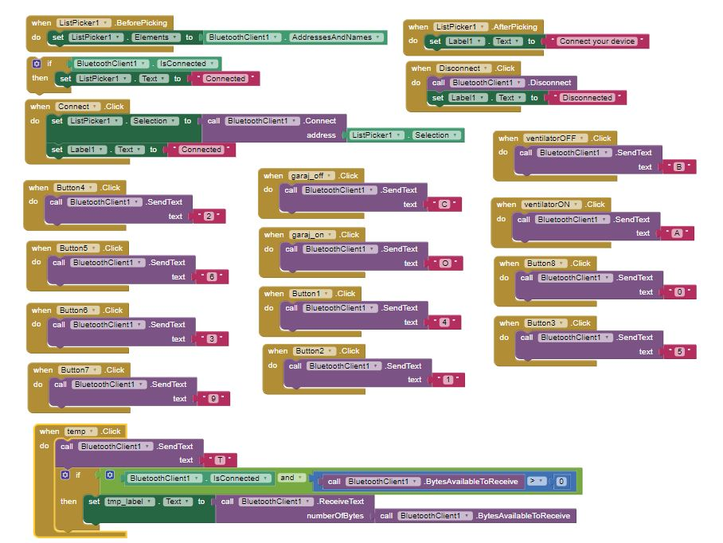
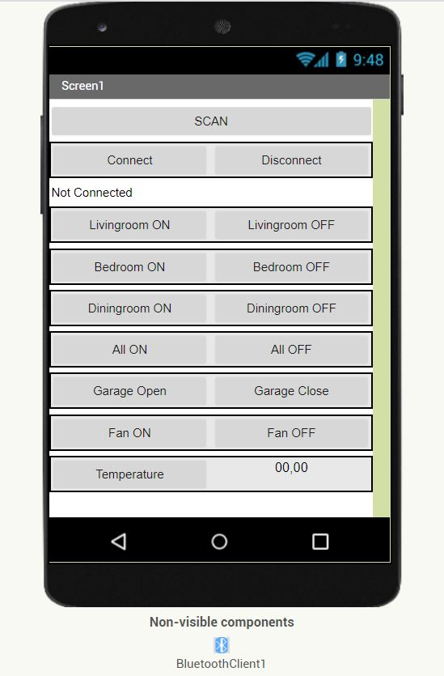
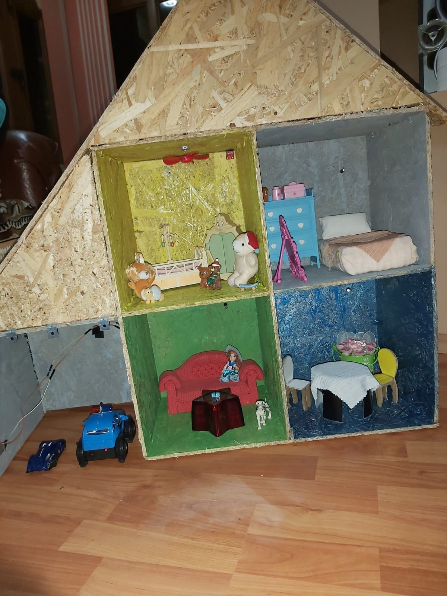
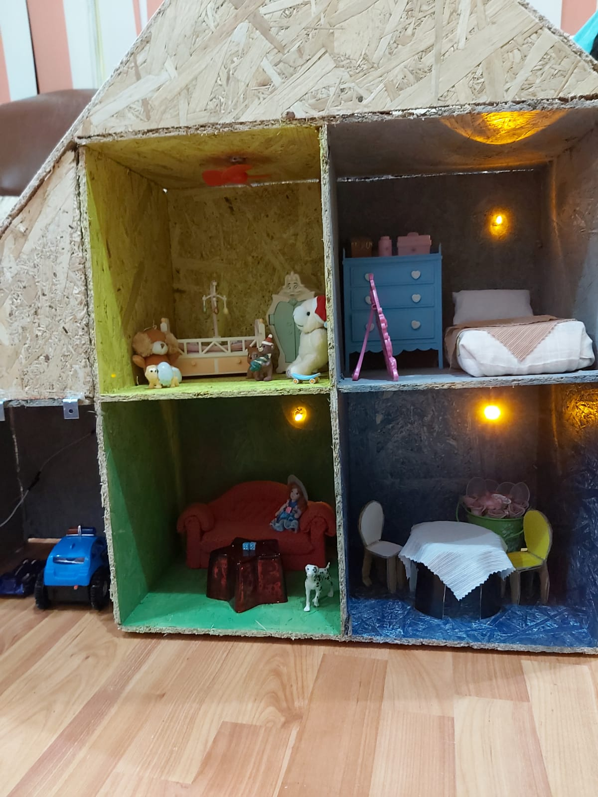
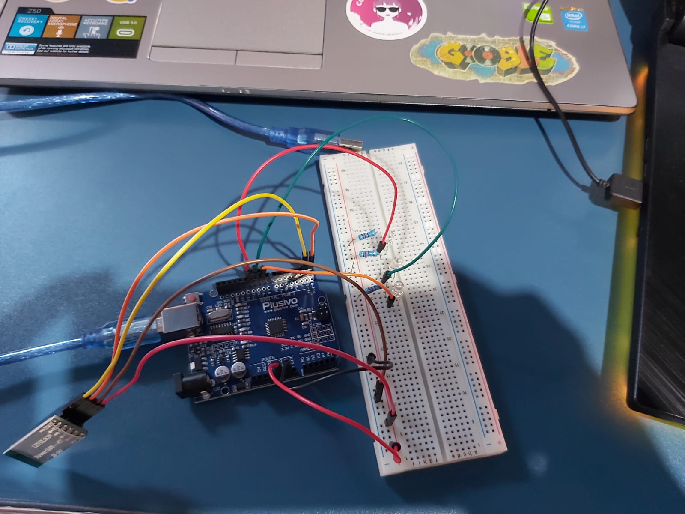
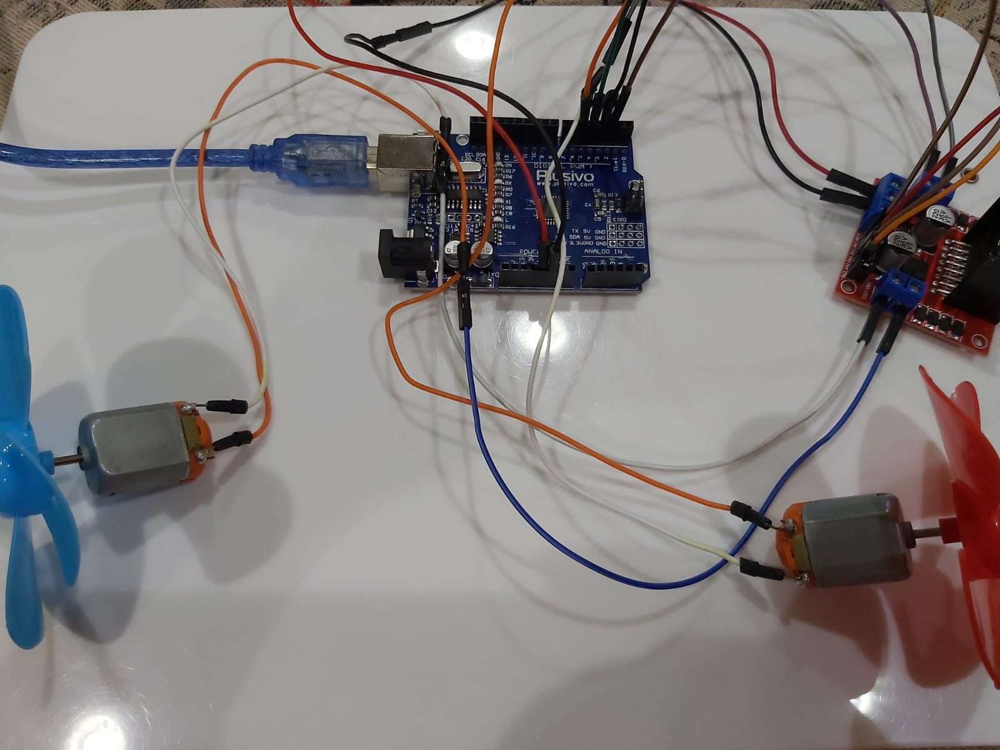

# Smart-Home-using-Arduino
Titlul proiectului: Automatizarea unei case
Functiile care urmeaza sa fie implementate:
Se va implementa o aplicatie pentru telefonul mobil prin care se vor controla urmatoarele obiecte:

    1. Leduri care vor reprezenta becurile din casa; se va controla aprinderea si stingerea lor din aplicatie.

    2. Pornirea si oprirea unui ventilator (va fi reprezentat de o elice actionata de un motor).

    3. Masurarea temperaturii dintr-o camera (functie realizata cu ajutorul unui senzor de temperatura).

    4. Deschiderea si inchiderea unei usi de garaj (functie realizata cu ajutorul unui motor si al unei cremaliere).

Pentru realizarea proiectului voi folosi: o placuta arduino uno, un modul bluetooth, un driver de motoare, doua motoare,
leduri, un senzor de temperatura.

Proiecte similare disponibile pe internet:

1. Home Automation using Arduino - https://www.youtube.com/watch?v=HG-W3-bLvpo&t=50s

In acest proiect sunt implementate functii precum aprinderea ledurilor, actionarea unor motoare, cu
ajutorul unei placute arduino nano.

2. Smart Home (Arduino Project) - https://www.youtube.com/watch?v=X9kCKAvE8Ks

In acest proiect sunt implementate functiile de baza ale unei case automatizate: lumini, temperatura,
sistem anti-furt si controlul portilor. Toate aceste functii sunt activate prin intermediul unei interfete
alcatuita din butoane.

3. Arduino Home Security System - https://www.youtube.com/watch?v=dRCnccv_dVE

In acest proiect este implementat un sistem de securitate pentru o casa, utilizand arduino, care
detecteaza cand un intrus patrunde in casa sau incearca sa deschida fortat usa.

Functionalitatile proiectului

Am realizat o aplicatie pentru telefonul mobil, prin care controlez toate functiile casei. Aplicatia este realizata cu ajutorul mediului de
programare MIT App Inventor si conexiunea cu placuta Arduino este realizata prin intermediul unui modul Bluetooth.

Interfata aplicatiei

Casuta este compusa din patru camere si un garaj. Trei dintre cele patru camere contin cate un led care se poate aprinde/ stinge din aplicatia
pentru telefonul mobil, iar a patra camera contine un motor la care s-a adaugat o elice (acestea reprezentand un ventilator) si un senzor de temperatura. Ventilatorul poate fi pornit/ oprit din aplicatie, dar de asemenea este programat sa porneasca automat atunci cand se depaseste
temperatura de 28 grade Celsius si sa se opreasca automat cand temperatura scade sub 20 de grade. Garajul este prevazut cu un motor pe care a
fost adaugata o rotita ce impreuna cu o cremaliera are rolul de a deschide si inchide usa garajului.

 

 
Montajul a fost realizat si testat pe bucati. Am inceput cu testarea ledurilor impreuna cu modulul Bluetooth.

Am testat in continuare motoarele care au fost conectate la placuta prin intermediul driverului L298N.

Ulterior am conectat toate partile impreuna, adaugand si senzorul de temperatura.
Link catre proiect: https://www.youtube.com/watch?v=0pDzHM-bQhU
